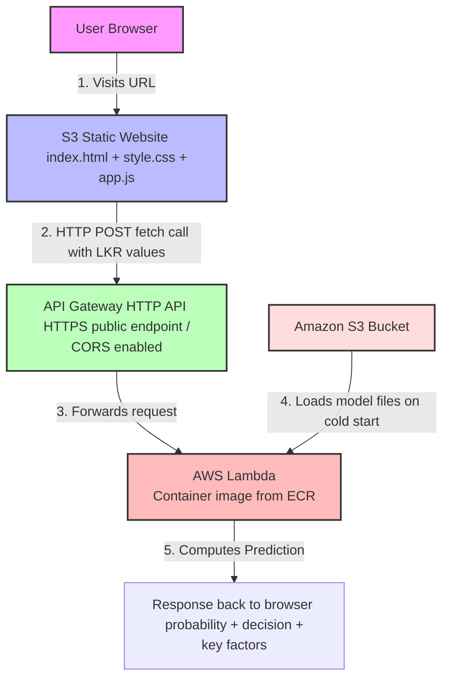

# Architecture — Loan Approval Predictor

## Why Docker Container Instead of ZIP Layer

### The Problem
Initial deployment attempted ZIP-based Lambda layers
for pandas, scikit-learn, numpy and scipy.

Combined unzipped size: ~400MB
AWS Lambda ZIP limit:   250MB

Attempts to reduce size by stripping test files
broke internal library structure causing
runtime syntax errors.

### The Solution
Switched to containerized Lambda using Amazon ECR.
Container images support up to 10GB — no size constraints.
Complete unbroken library installations preserved.

### Deployment Flow
CloudShell
-> docker build (Dockerfile)
-> docker push (ECR repository)
-> Lambda updated (aws lambda update-function-code)
-> API Gateway (unchanged)
-> S3 Frontend (unchanged)

### Cost
ECR free tier: 500MB private storage/month
Our image:     ~350MB
Cost:          $0.00

### Future Updates
1. Edit lambda_function.py
2. Rebuild image in CloudShell
3. Push to ECR
4. Run: aws lambda update-function-code
   --function-name loan-approval-container
   --image-uri 951869163850.dkr.ecr.ap-south-1.amazonaws.com/loan-approval:latest

## Full Architecture Diagram

```markdown

## AWS Services Used

| Service     | Purpose                        | Cost          |
|-------------|--------------------------------|---------------|
| ECR         | Docker image registry          | Free (500MB)  |
| Lambda      | Serverless ML inference        | Free tier     |
| API Gateway | Public HTTPS endpoint          | Free tier     |
| S3          | Model storage + static website | Free tier     |
| CloudShell  | Build and deploy environment   | Free          |
| IAM         | Role based access control      | Free          |
| CloudWatch  | Logging and monitoring         | Free tier     |

Total monthly cost: $0.00